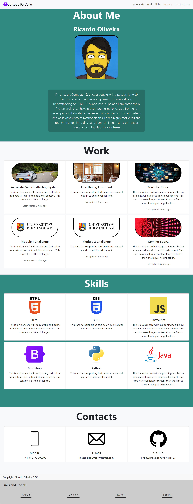

# Bootstrap Portfolio -- UoB Bootcamp Module 2 Challenge -- roliveira527

## Description
Module 3 Challenge for UoB Skills Bootcamp in Front-End Web Development & UX

## Objective
The objective of this challenge is to develop a portfolio webpage using Bootstrap 5.

## Deployment
The page is deployed on GitHub Pages which can be accessed via the link: https://roliveira527.github.io/bootstrap-portfolio-roliveira527/

## Screenshot

